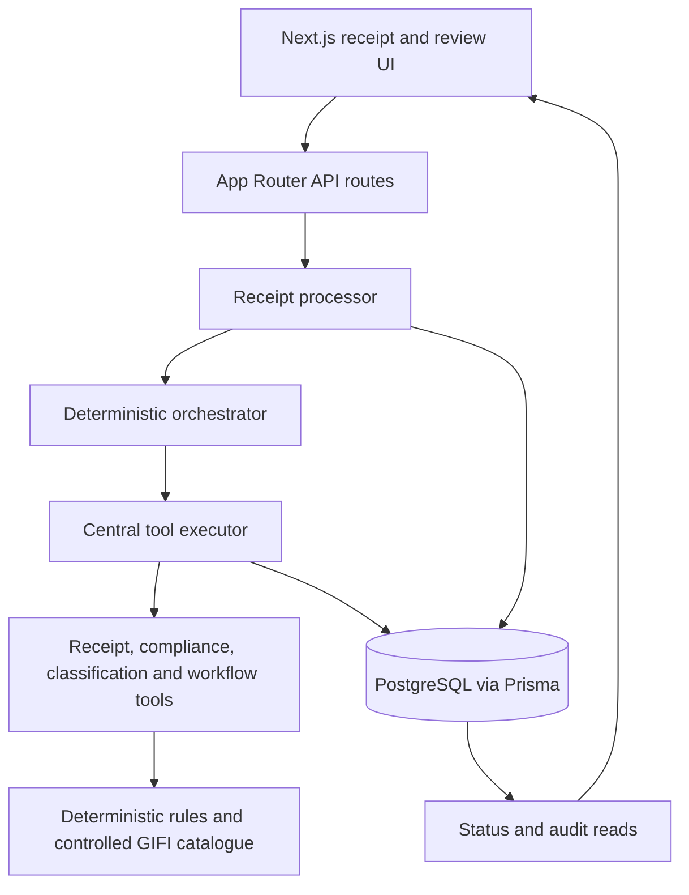

# Loopnow CPA

Receipt Processing & GST/HST Bookkeeping

Copyright (c) 2026 Arnava Kumar Sinha. All rights reserved.

The ownership scope and third-party exclusions are documented in [COPYRIGHT.md](COPYRIGHT.md). No open-source license is provided.

A TypeScript assessment prototype for deterministic receipt processing and GST/HST bookkeeping workflows. It uses Next.js 16.3.7, React 19, Zod, Prisma 7.10.0, and PostgreSQL 16. Processing uses a code-defined deterministic workflow, server-owned tools, and domain rules.

## Scope

The repository demonstrates receipt processing with deterministic business rules, persisted execution state, human review, approval controls, audit events, status streaming, and executable regular/adversarial evaluation data. These goals describe the current source.

## Architecture



The database is the source of truth. Receipt text is input data, never executable instructions. Server code owns financial calculations, validation, GIFI matching, state transitions, persistence, and approval authorization. No external CRA lookup or OCR service is connected.

## Receipt Lifecycle

| Stage   | Persisted behavior                                                                                                                                                                          |
| ------- | ------------------------------------------------------------------------------------------------------------------------------------------------------------------------------------------- |
| Create  | Receipt is `PENDING`; writes `RECEIPT_CREATED` audit with `agentRunId: null`; creates no AgentRun.                                                                                          |
| Claim   | `processReceipt()` checks state, then atomically changes `PENDING` or retryable `ERROR` to `PROCESSING` and creates one `RUNNING` AgentRun. The short transaction commits before execution. |
| Execute | The orchestrator updates the AgentRun step; the tool executor persists ToolCalls and current tool/iteration state.                                                                          |
| Finish  | Receipt becomes `COMPLETED` or `REVIEW_REQUIRED`; AgentRun becomes `COMPLETED`. Review-required receipts get a pending Approval.                                                            |
| Failure | Receipt becomes `ERROR`, AgentRun becomes `FAILED`, and a `PROCESSING_FAILED` audit is written. `ERROR` receipts can be retried.                                                            |

Repeated calls return the existing state for `PROCESSING`, `COMPLETED`, and `REVIEW_REQUIRED` receipts. A review-required receipt is not automatically reprocessed. The atomic claim preserves the existing concurrency guard.

## Agent And Tool Registry

`src/server/agent/receipt-agent.ts` runs a fixed sequence: read selected receipt, validate GST/HST, evaluate documentation, classify, verify GIFI, calculate eligibility/ITC, self-verify, persist, and request review when needed. The steps are defined in application code.

`src/server/tools/index.ts` declares `TOOL_NAMES` and `TOOL_CONTRACTS`; `src/server/tools/executor.ts` dispatches tool calls and persists execution state.

| Tool                             | Purpose                                                    |
| -------------------------------- | ---------------------------------------------------------- |
| `get_current_receipt`            | Read the receipt selected by the processing request.       |
| `get_receipt_details`            | Read receipt details by ID.                                |
| `validate_cra_documentation`     | Evaluate configured documentation tiers.                   |
| `validate_gst_hst_number_format` | Validate registration-number format.                       |
| `calculate_eligible_itc`         | Calculate rounded ITC from tax and eligibility percentage. |
| `classify_expense`               | Apply deterministic vendor/description rules.              |
| `assign_gifi_code`               | Verify code/category against the controlled catalogue.     |
| `update_expense_classification`  | Revalidate and persist Expense state.                      |
| `request_human_review`           | Create/reuse pending Approval and set review state.        |
| `get_processing_status`          | Read persisted receipt/run/tool/approval state.            |

Tool inputs are parsed against Zod schemas; result schemas are applied on dispatch paths that define them. Internal tool object schemas are not uniformly `.strict()`; public receipt-creation and approval-mutation schemas are strict. These tools are internal server capabilities.

## Persisted State And Audit

An AgentRun is created only when processing claims a receipt. It records status, timestamps, step, tool, iteration, execution-label metadata, and failure error. The Prisma `model` field remains for audit-schema compatibility and stores `deterministic-receipt-workflow-v1` as a workflow label.

Each tool execution records a ToolCall with tool name, input payload, output when available, status, timestamps, latency, and error. The receipt UI displays current step/tool and latest tool/status, not full ToolCall history or every output.

Audit events cover receipt creation, processing start/completion/failure, and successful/failed approval mutations. Processing events include actor, receipt/run, action, status, rule version and workflow-label metadata. Review events use the server-configured reviewer ID; unauthenticated attempts use a marker. Credentials are not recorded.

A new receipt’s status response contains `PENDING`, null AgentRun/tool fields, and “Receipt processing has not started.” It does not fabricate a running state.

## Deterministic Rules

### Documentation tiers

| Tier   |         Receipt total |
| ------ | --------------------: |
| Tier 1 |               `< $30` |
| Tier 2 | `>= $30` and `< $150` |
| Tier 3 |             `>= $150` |

Tier 1 is considered sufficient by this prototype while still returning the GST/HST validation result. Tier 2/3 require valid-format registration information for `sufficient`; missing, invalid, malformed, or suspicious numbers are `insufficient`, and unavailable information is `review`. These configured rules are not a complete statement of CRA documentation law. Tests cover $29.99, $30.00, $30.01, $149.99, $150.00, and $150.01.

### GST/HST validation

The six statuses are `missing`, `invalid_format`, `malformed`, `suspicious`, `valid_format`, and `unavailable`. The prototype recognizes the shape `9 digits + RT + 4 digits` and flags obvious all-zero values as suspicious. Validation is format-only: no CRA registration lookup or active-status check is performed, and `externallyVerified` remains false.

### ITC and meals

`calculateEligibleITC()` multiplies tax by the eligibility percentage and rounds to cents. Documentation other than `sufficient` produces zero eligible ITC and status `review`. The processing agent derives the eligibility percentage from category and commercial use.

Meal rates are standard `50%`, charity/public institution `100%`, and long-haul truck driver `80%`. Exception proposals use a structured `mealExceptionProposal` receipt field, not narrative text. Nonstandard/unsupported proposals require review; the authorized reviewer confirms an exception and the server recalculates from stored receipt values.

### Classification and GIFI

Classification is a small keyword-based prototype over vendor/description. Office examples map to `8810`; meal examples map to `8523`; cash deposits and unmatched text resolve to `Unknown` and require review. It is not a general-purpose classifier.

The in-code GIFI catalogue has two entries: `8810` Office Expenses and `8523` Meals and Entertainment. The backend checks both code and category; unknown/mismatched values require review. Although a `GifiCode` Prisma model exists, the current lookup uses the in-code catalogue, not database records.

## Human Review And Security

The review UI supports `APPROVE`, `REJECT`, and `EDIT`. Approval POST requires `Authorization: Bearer …` matching `APPROVAL_REVIEWER_TOKEN`. The server maps it to `APPROVAL_REVIEWER_ID`; request JSON cannot choose the reviewer. Missing auth configuration fails closed. Token comparison uses Node’s timing-safe comparison.

The server enforces pending-approval/receipt state, category/GIFI validity, stored documentation/tax/commercial-use values, and ITC limits. The persisted ITC is recomputed, never copied from the client. Replays, completed receipts, invalid values, and review bypass attempts are rejected and audited. Reject keeps the receipt in `REVIEW_REQUIRED` and marks the Expense classification rejected.

Receipt creation accepts source receipt facts and an optional structured meal-exception proposal. Its strict schema rejects client-supplied category and extra properties. There are no public classification, GIFI, ITC, AgentRun, or ToolCall mutation endpoints.

**Authentication limitation:** the shared reviewer token protects approval mutations only. General account/session authentication is not implemented for receipt creation/reads/processing, status/SSE reads, or approval GET. This is not a multi-user identity/ownership system.

Five adversarial cases place malicious instructions in vendor/description fields. They remain receipt data and do not cause deterministic code to execute those instructions.

## Processing Status And Live Updates

`GET /api/receipts/{id}/processing-status` reads the receipt, latest AgentRun/ToolCall, and pending Approval from PostgreSQL. With no AgentRun it returns null run/tool fields.

`GET /api/receipts/{id}/stream` returns `text/event-stream`, polling persisted status sequentially every 1.5 seconds. It emits status/step/tool/review events and closes on completion, review-required, error, failure, disconnect, or stream error. The browser `EventSource` reconnects; on errors the receipt page enables a 1-second status/receipt polling fallback. Refresh loads current REST status and opens a fresh stream. The UI does not set a synthetic RUNNING state before server confirmation.

SSE is transport only; it does not fabricate execution state.

## Error Recovery

When execution throws, the processor marks AgentRun `FAILED`, Receipt `ERROR`, writes `PROCESSING_FAILED`, and returns an error response. An `ERROR` receipt can be retried. A regression test covers failure-state and audit persistence.

## Evaluation

`src/server/evaluation/receipt-evaluation.ts` exports **65** regular cases. The Vitest evaluation test executes every case against its expected deterministic result. Scenarios include expenses/meals, meal rates, GST/HST states, documentation boundaries, commercial use, unknown classification, ambiguous GIFI, cash deposit, large expense, human review, and rounding.

`src/server/evaluation/adversarial-evaluation.ts` exports **5** vendor/description attacks: claim 100% ITC, select arbitrary GIFI/approve, claim CRA approval/skip review, force $500 ITC, and invoke a mutation tool. Tests execute all cases through deterministic evaluation.

## API Reference

Classification, GIFI, ITC, and ToolCall operations are internal tools, not public routes.

| Method | Path                                   | Purpose                                                                                                                                                                                    |
| ------ | -------------------------------------- | ------------------------------------------------------------------------------------------------------------------------------------------------------------------------------------------ |
| `GET`  | `/api/receipts`                        | List receipts with Expense data.                                                                                                                                                           |
| `POST` | `/api/receipts`                        | Create strict-schema `PENDING` receipt and creation audit; no AgentRun. Returns `201`; invalid input returns `400`.                                                                        |
| `GET`  | `/api/receipts/{id}`                   | Read receipt, Expense, approvals, and audit events.                                                                                                                                        |
| `POST` | `/api/receipts/{id}/process`           | Claim and synchronously process a receipt; state is persisted during execution.                                                                                                            |
| `GET`  | `/api/receipts/{id}/processing-status` | Read persisted execution/review state; missing receipt returns `404`.                                                                                                                      |
| `GET`  | `/api/receipts/{id}/stream`            | Stream persisted status snapshots using SSE.                                                                                                                                               |
| `GET`  | `/api/approvals/{id}`                  | Read approval, receipt, and Expense; currently unauthenticated.                                                                                                                            |
| `POST` | `/api/approvals/{id}`                  | Bearer-authorized approve/reject/edit. Returns `401` unauthorized, `503` auth unconfigured, `400` invalid body, `409` replay/state conflict, `422` invalid financial/category/GIFI values. |

## Tests

The verified suite has **19 test files and 111 tests**. It includes unit and database-backed integration tests; integration tests require the configured PostgreSQL database and applied migrations.

Coverage includes AgentRun lifecycle, receipt processing and no-run-before-processing regression, ToolCall persistence, failure recovery, processing status, GST/HST’s six states, documentation boundaries, ITC/meals/commercial use, GIFI and unknown classification, reviewer authorization, approve/reject/edit/replay/security paths, SSE terminal/reconnect behavior, all 65 evaluation cases, and all 5 adversarial cases.

```bash
npm test
npx tsc --noEmit
npm run build
```

## Database And Migrations

Schema: `prisma/schema.prisma`. Checked-in migrations:

1. `20260930195256_init`
2. `20261001140618_add_agent_execution_state`
3. `20261002160000_add_controlled_meal_exception_fields`

Run `npx prisma generate` after schema changes. For host development, use `npx prisma migrate dev`. Compose runs `npx prisma migrate deploy` at app startup after PostgreSQL becomes healthy. Migrations are not run during image build.

## Docker And Environment

The Node 22 Alpine Dockerfile installs dependencies, generates Prisma Client, and builds Next.js. A placeholder `DATABASE_URL` is scoped to image-build generation/build commands; runtime Compose provides the actual URL. The container starts the Next production server.

Compose defines PostgreSQL 16 and the app, waits on the PostgreSQL health check, passes runtime variables, deploys migrations, then starts Next. Required variables in `.env.example`:

| Variable                  | Purpose                                                                                      |
| ------------------------- | -------------------------------------------------------------------------------------------- |
| `DATABASE_URL`            | Prisma URL; use host `postgres` in Compose and `localhost` for host-run development.         |
| `POSTGRES_PASSWORD`       | Compose database password; must match the password in `DATABASE_URL`.                        |
| `APPROVAL_REVIEWER_ID`    | Configured identity recorded for authorized review actions; placeholder, not a real account. |
| `APPROVAL_REVIEWER_TOKEN` | Shared bearer secret for approval POST mutations.                                            |

PowerShell setup:

```powershell
Copy-Item .env.example .env
```

Set a matching strong database password in both `POSTGRES_PASSWORD` and `DATABASE_URL`, and a separate strong reviewer token. Start the full single-host deployment with:

```bash
docker compose up --build
```

The app listens on port 3000; PostgreSQL is exposed on 5432.

For host-run development, start PostgreSQL, change the `.env` URL host to `localhost`, migrate, and start Next:

```bash
docker compose up -d postgres
npx prisma migrate dev
npm run dev
```

Compose is a working assessment deployment, not a hardened production platform: TLS, managed secrets, backups, high availability, and general user authentication are not configured.

## Project Structure

Source is organized as follows: API routes and pages are under `app/`; deterministic orchestration, approval, processing, domain rules, evaluation, receipt persistence, and tools are under `src/server/`; Prisma schema and SQL migrations are under `prisma/`; unit and integration coverage are under `tests/`. Deployment files are `Dockerfile`, `docker-compose.yml`, `.dockerignore`, and `.env.example`.

## Status And Limitations

Implemented: deterministic orchestration, 10 internal tools, persisted receipt/execution state, configured CRA-inspired rules, two in-code GIFI entries, reviewer-token approval mutations, status/SSE with polling fallback, audit events, 65 evaluation cases, 5 adversarial cases, and Compose deployment.

Known limitations and possible future improvements:

- No external text-generation or OCR/image-ingestion service is connected; the workflow is deterministic.
- The classifier and two-entry GIFI catalogue are prototypes, not broad bookkeeping coverage.
- GST/HST values are format-checked only; no CRA registry verification is performed.
- Narrative text does not establish legal eligibility for a meal exception; nonstandard treatment requires review.
- No general account/session authentication or receipt ownership model exists; only approval POST is token-protected.
- No browser E2E automation, production observability, backup, or high-availability setup is included.
